# React + TypeScript + Vite

This template provides a minimal setup to get React working in Vite with HMR and some ESLint rules.

Currently, two official plugins are available:

- [@vitejs/plugin-react](https://github.com/vitejs/vite-plugin-react/blob/main/packages/plugin-react/README.md) uses [Babel](https://babeljs.io/) for Fast Refresh
- [@vitejs/plugin-react-swc](https://github.com/vitejs/vite-plugin-react-swc) uses [SWC](https://swc.rs/) for Fast Refresh

## Expanding the ESLint configuration

If you are developing a production application, we recommend updating the configuration to enable type aware lint rules:

- Configure the top-level `parserOptions` property like this:

```js
export default tseslint.config({
  languageOptions: {
    // other options...
    parserOptions: {
      project: ['./tsconfig.node.json', './tsconfig.app.json'],
      tsconfigRootDir: import.meta.dirname,
    },
  },
})
```

- Replace `tseslint.configs.recommended` to `tseslint.configs.recommendedTypeChecked` or `tseslint.configs.strictTypeChecked`
- Optionally add `...tseslint.configs.stylisticTypeChecked`
- Install [eslint-plugin-react](https://github.com/jsx-eslint/eslint-plugin-react) and update the config:

```js
// eslint.config.js
import react from 'eslint-plugin-react'

export default tseslint.config({
  // Set the react version
  settings: { react: { version: '18.3' } },
  plugins: {
    // Add the react plugin
## 🚧 Development Status

### 📊 Dashboard & User Features
- **Dashboard:** Currently using sample data for visualization
  - 📈 Watch time trends
  - 📊 Genre distribution
  - 🎬 Trending movies
  - 📈 User statistics

- **User Profile:** Operating with mock data
  - 👤 User information
  - 📈 Watch history
  - ❤️ Favorites
  - 🎯 Preferences

- **Settings:** Implemented with static content
  - 🎨 Theme preferences
  - 🔔 Notification settings
  - 🌍 Language options
  - 🎭 Genre preferences

### 🔐 Authentication & Session Management

> ⚠️ **Note:** Due to Supabase database connectivity issues, the following features are using temporary implementations:

#### Current Implementation:
- ✅ Google Authentication sign-in/sign-up
- ❌ Session persistence not implemented
- ❌ Token management pending
- ❌ User data synchronization waiting for database connection

#### Planned Features (Pending Database Connection):
- 🔄 Persistent sessions
- 🔑 Secure token management
- 💾 User data storage
- 🔒 Protected routes
- 🔄 Real-time data synchronization

### 🗃️ Data Management

```mermaid
graph TD
    A[User Interface] -->|Sample Data| B[Dashboard]
    A -->|Mock Data| C[Profile]
    A -->|Static Content| D[Settings]
    E[Google Auth] -->|Authentication| A
    F[Database Connection] -->|⚠️ Pending| A
```


### 🔜 Next Steps
1. 🔌 Establish Supabase database connection
2. 🔐 Implement session management
3. 💾 Migrate from sample to real data
4. 🔄 Add real-time synchronization
5. 📱 Enhance user experience with actual data

---
    react,
  },
  rules: {
    // other rules...
    // Enable its recommended rules
    ...react.configs.recommended.rules,
    ...react.configs['jsx-runtime'].rules,
  },
})
```
